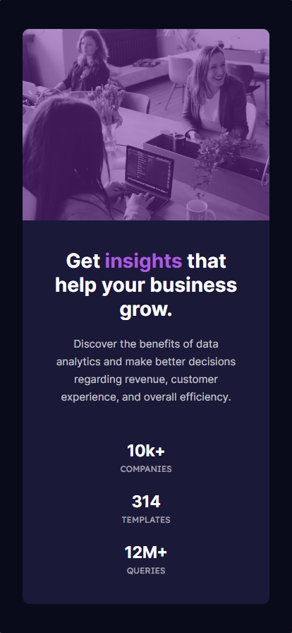

<h1 align="center">
  Stats Preview Card
</h1>
<p align="center">
    Website cartão <a href="https://jonathanbenedito.github.io/stats-preview-card/" target="_blank">jonathanbenedito.github.io/stats-preview-card</a>, que promove serviços de consultoria em dados e análise para empresas.
</p>


## 🛠 Guia de instalação

1. Faça o clone do projeto
    ```
    git clone https://github.com/jonathanBenedito/stats-preview-card.git
    ```

2. Acesse o repositório
    ```
    cd stats-preview-card
    ```

## 💬 Sobre o projeto

### O desafio

A proposta é construir um cartão centralizado de página única utilizando HTML e CSS, o website deve ser responsivo a diferentes tamanhos de tela, e o layout deve ser mais próximo possível ao design fornecido pelo desafio Frontend Mentor.

### Fotos (Mobile)



### Links

Website: <a href="https://jonathanbenedito.github.io/stats-preview-card/">https://jonathanbenedito.github.io/stats-preview-card/</a><br />
Desafio do Frontend Mentor: <a href="https://www.frontendmentor.io/challenges/stats-preview-card-component-8JqbgoU62">https://www.frontendmentor.io/challenges/stats-preview-card-component-8JqbgoU62</a>

### Tecnologias

O website foi construído usando apenas HTML5 e CSS3.

<div style="display: flex; margin-top: 15px; gap: 20px;">
  
  
</div>
